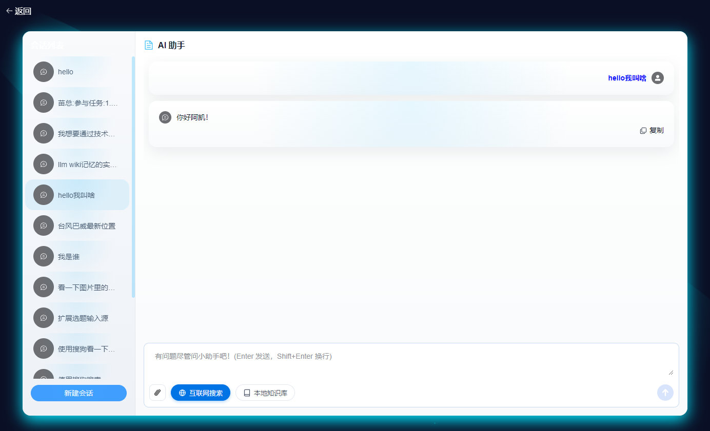
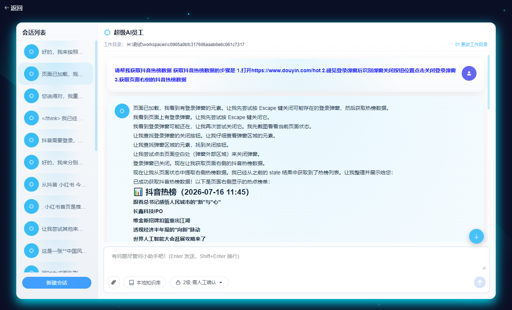
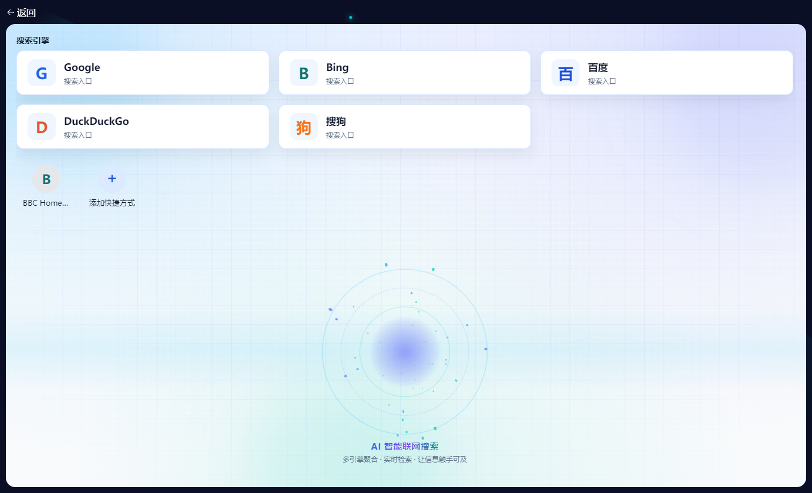
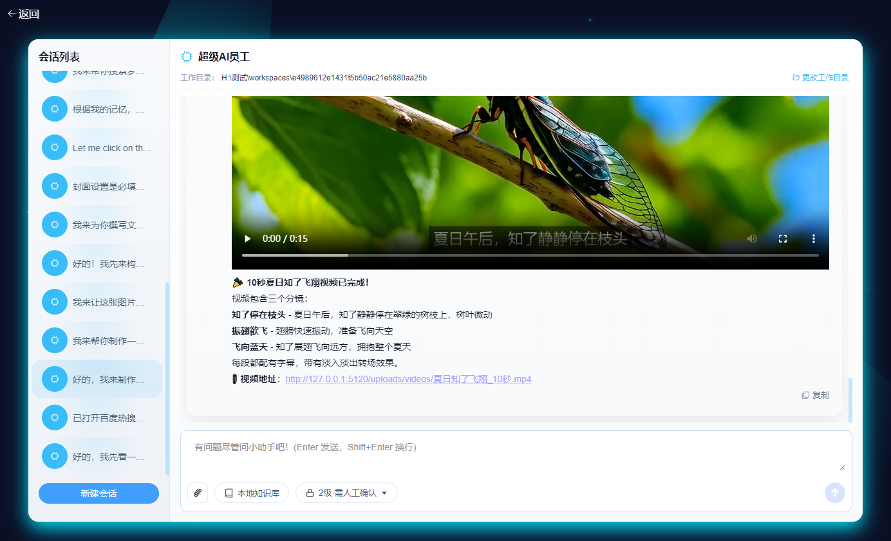
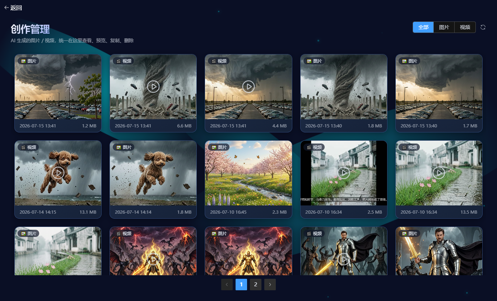
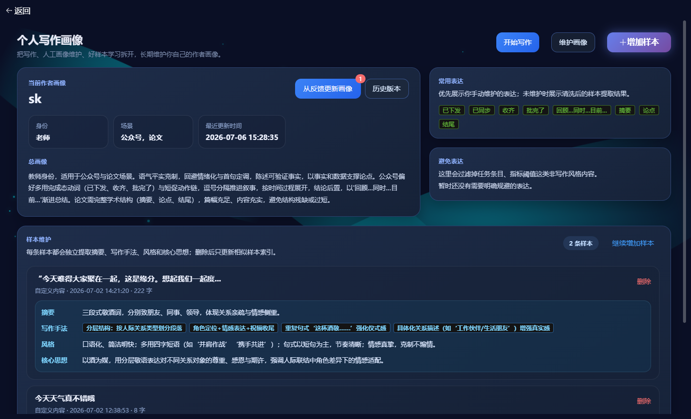
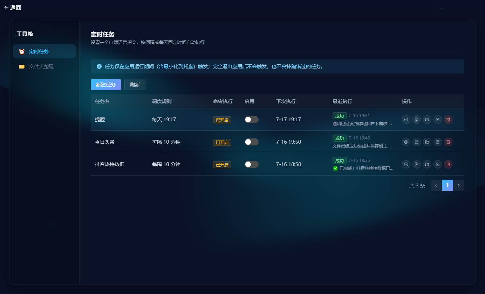
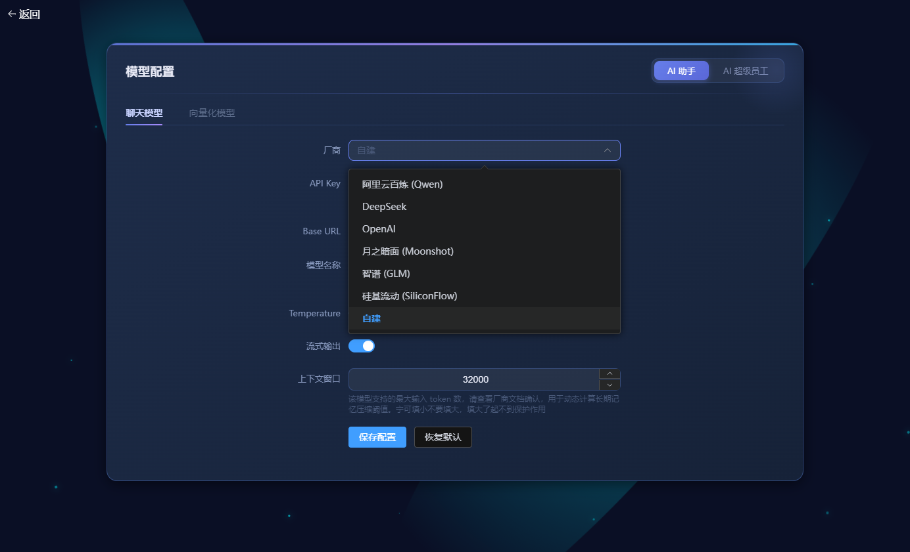
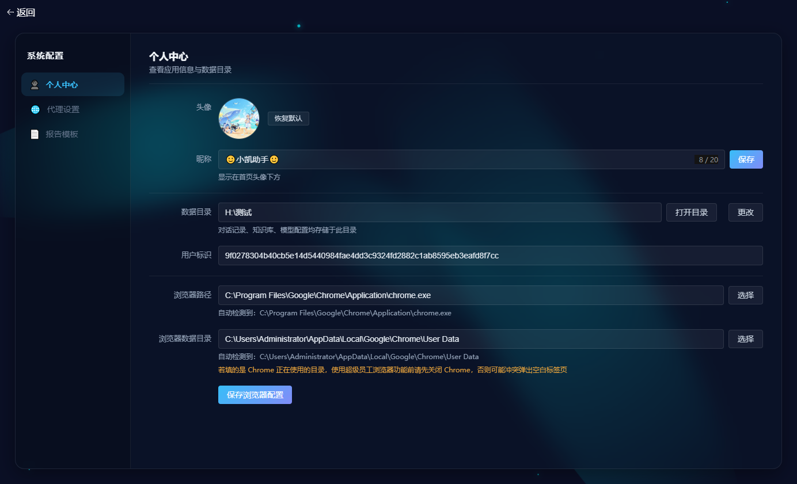

# AI助手 (SkDAI)

结合 AI 大模型能力的本地办公助手桌面应用,基于 Electron + Vue3 + TypeScript 开发。数据(对话记录、知识库向量、写作风格样本等)默认存储在本地,不依赖云端账号体系,支持自由切换多家大模型供应商。

## 功能特性

- 💬 **AI 对话 / 跨会话记忆**:多轮聊天,自动压缩历史对话生成长期记忆摘要,换个新会话也能记得你是谁、聊过什么
- 📚 **知识库 / RAG**:导入本地文档建立向量库,基于文档内容进行问答与辅助写作
- 🌐 **免费联网搜索**:内置 Google、Bing、百度、DuckDuckGo、搜狗多引擎聚合检索,不依赖付费搜索 API,也能让对话具备实时联网能力
- 🤖 **AI 超级员工(Agent)**:可调用本地文件操作、浏览器自动化等工具执行复杂任务的智能体
- ✍️ **写作风格**:学习用户历史文本的写作风格,辅助生成贴合个人风格的内容
- 🎨 **媒体生成 / 视频合成**:文生图、图生视频,支持多片段拼接、配字幕、配背景音乐,自动合成完整短视频
- 📄 **生成报告**:商务、报告、简约、学术、情报共 5 种排版模板,一键导出 Word / PDF
- 🧰 **工具箱**:文件整理、定时任务等实用小工具集合
- ⚙️ **多模型配置**:支持阿里云百炼(Qwen)、DeepSeek、OpenAI、Moonshot(月之暗面)、智谱(GLM)、硅基流动(SiliconFlow)等模型供应商自由切换配置
- 💾 **本地数据目录 · 可迁移**:对话记录、知识库、模型配置统一存放在用户自选的数据目录,换电脑时整个目录复制过去即可迁移,不绑定任何云账号

## 界面预览

| | |
| --- | --- |
| **首页** | **AI 助手对话** |
|  |  |
| **AI 超级员工 · 浏览器自动化** | **联网搜索** |
|  |  |
| **文生图 / 图生视频** | **创作管理** |
|  |  |
| **个人写作画像** | **工具箱(定时任务)** |
|  |  |
| **模型配置** | **系统配置** |
|  |  |

## 技术栈

Electron + Vue 3 + TypeScript + Vite + LangChain.js + better-sqlite3 + Element Plus

## 环境要求

```
node v20+.x
```

## Project Setup

### Install
```bash
npm install
```

### Development

```bash
$ npm run dev
```

Linux 下如需关闭沙盒模式调试:
```bash
$ npm run devLinux
```

### Build

```bash
# For windows
$ npm run build:win

# For macOS
$ npm run build:mac

# For Linux
$ npm run build:linux
```

## 环境变量配置

项目部分功能(联网搜索工具、LangSmith 可观测性)依赖 `.env` 文件中的环境变量,请参考仓库内的 `.env.example` 自行创建 `.env` 文件并填入自己的配置,**不要将真实密钥提交到版本库**。

Linux 环境安装过程中常见的报错(node-gyp 编译失败、gcc 版本过低等)及解决办法见 [READMELinux.md](READMELinux.md)。

---

# chrome-sandbox 4755权限问题的解决办法

在Electron项目中，chrome-sandbox（通常称为沙盒机制）是一种重要的安全特性，它借鉴了Chromium浏览器的沙盒设计，用于限制渲染进程对系统资源的访问，从而提高应用的安全性。沙盒是一种隔离技术，可以将应用的不同部分隔离开来，避免它们直接访问操作系统资源。在Electron中，沙盒模式类似于Chrome浏览器的沙盒，它可以让渲染进程中的代码受到严格限制，阻止它们直接访问系统资源和Node.js API。
electron项目是默认启用沙盒的，在linux操作系统中打的安装包在安装后启动程序时后报chrome-sandbox缺少4755权限的问题。解决这个问题有两种方案
- 通过修改配置文件，关闭沙盒。
- 通过修改electron-build.yml打包配置文件，添加`afterInstall`脚本，实现程序安装后自动为`chrome-sandbox`赋4755权限。

以下是实现步骤
## 1. 准备文件
复制`chrome-sandbox`文件到build目录下。

在build目录下新建`set-chrome-sandbox-permissions.sh`和`cleanup.sh`文件，分别用于为`chrome-sandbox`赋4755权限，以及程序卸载后的清理。

## 2.修改`electron-builder.yml`配置

```yml
appId: sk_ai
productName: SkDAI

directories:
  buildResources: build

files:
  - '!**/.vscode/*'
  - '!src/*'
  - '!electron.vite.config.{js,ts,mjs,cjs}'
  - '!{.eslintignore,.eslintrc.cjs,.prettierignore,.prettierrc.yaml,dev-app-update.yml,CHANGELOG.md,README.md}'
  - '!{.env,.env.*,.npmrc,pnpm-lock.yaml}'
  - '!{tsconfig.json,tsconfig.node.json,tsconfig.web.json}'

extraFiles:
  - from: build/chrome-sandbox
    to: chrome-sandbox

asarUnpack:
  - resources/**

afterSign: build/notarize.js

win:
  executableName: SkDAI

nsis:
  artifactName: ${name}-${version}-setup.${ext}
  shortcutName: ${productName}
  uninstallDisplayName: ${productName}
  createDesktopShortcut: always
  runAfterFinish: false
  oneClick: false
  allowElevation: true
  allowToChangeInstallationDirectory: true

mac:
  entitlementsInherit: build/entitlements.mac.plist
  extendInfo:
    - NSCameraUsageDescription: Application requests access to the device's camera.
    - NSMicrophoneUsageDescription: Application requests access to the device's microphone.
    - NSDocumentsFolderUsageDescription: Application requests access to the user's Documents folder.
    - NSDownloadsFolderUsageDescription: Application requests access to the user's Downloads folder.

dmg:
  artifactName: ${name}-${version}.${ext}

linux:
  target:
    - AppImage
    - snap
    - deb
  maintainer: electronjs.org
  category: Utility

deb:
  priority: optional
  afterInstall: build/set-chrome-sandbox-permissions.sh
  afterRemove: build/clean.sh


appImage:
  artifactName: ${name}-${version}.${ext}

npmRebuild: false

publish:
  provider: generic
  url: https://example.com/auto-updates

```
- 第15-17行，复制`chrome-sandbox`文件到程序目录下。
- 第56-59行，配置程序安装后以及程序卸载后执行指定的脚本，可以将bash脚本换成js脚本。

## 3. 编写`set-chrome-sandbox-permissions.sh`脚本
/build/set-chrome-sandbox-permissions.sh
```bash
#!/bin/bash
set -e

# 默认 Electron 应用安装目录（你要根据实际修改）
APP_DIR="/opt/SkDAI"
SANDBOX_PATH="$APP_DIR/chrome-sandbox"
EXECUTABLE_PATH="$APP_DIR/SkDAI"
LINK_PATH="/usr/bin/SkDAI"

echo "👉 APP_DIR=$APP_DIR"
echo "👉 EXECUTABLE_PATH=$EXECUTABLE_PATH"
echo "👉 LINK_PATH=$LINK_PATH"

# 判断chrome-sandbox是否存在
if [ ! -f "$SANDBOX_PATH" ]; then
  echo "❌ 找不到 chrome-sandbox：$SANDBOX_PATH"
  exit 1
fi

# 检查是否已有 override 存在
if dpkg-statoverride --list "$SANDBOX_PATH" > /dev/null 2>&1; then
  echo "ℹ️ 已存在 override，准备移除"
  dpkg-statoverride --remove "$SANDBOX_PATH"
fi

# 注册 statoverride，以确保权限生效
dpkg-statoverride --update --add root root 4755 "$SANDBOX_PATH"

echo "✅ chrome-sandbox 权限和属主设置完成：$SANDBOX_PATH"

# 添加 /usr/bin/SkDAI 软链接（存在则跳过）
if [ ! -L "$LINK_PATH" ]; then
  sudo ln -s "$EXECUTABLE_PATH" "$LINK_PATH"
  echo "✅ 创建软链接：$LINK_PATH -> $EXECUTABLE_PATH"
else
  echo "ℹ️ 软链接已存在：$LINK_PATH"
fi

echo "✅ 权限和软链接设置完成"

```

## 4.卸载清理脚本
/build/cleanup.sh
```bash
#!/bin/bash

# Cleanup script for Electron app uninstallation

set -e

echo "Running cleanup script for SkDAI..."

# Remove desktop entry
DESKTOP_FILE="/usr/share/applications/anming-SkDAI.desktop"
if [ -f "$DESKTOP_FILE" ]; then
    echo "Removing desktop entry..."
    if command -v pkexec >/dev/null 2>&1; then
        pkexec rm -f "$DESKTOP_FILE"
    elif command -v sudo >/dev/null 2>&1; then
        sudo rm -f "$DESKTOP_FILE"
    else
        echo "Warning: Cannot remove desktop entry, please manually delete: $DESKTOP_FILE"
    fi
fi

# Update desktop database
if command -v update-desktop-database >/dev/null 2>&1; then
    echo "Updating desktop database..."
    update-desktop-database /usr/share/applications/ 2>/dev/null || true
fi

# Remove application directory if it exists and is empty
APP_DIR="/opt/SkDAI"
if [ -d "$APP_DIR" ]; then
    echo "Checking application directory for cleanup..."
    if [ -z "$(ls -A "$APP_DIR" 2>/dev/null)" ]; then
        echo "Removing empty application directory..."
        rmdir "$APP_DIR" 2>/dev/null || true
    fi
fi
# Remove Soft_link
LINK_PATH="/usr/bin/SkDAI"
if [ -L "$LINK_PATH" ]; then
  rm "$LINK_PATH"
  echo "✅ 已删除软链接：$LINK_PATH"
fi

echo "Cleanup completed successfully"

exit 0
```

## 5.todos
以上两个bash脚本，可以修改为js脚本。

## 语音包安装
sudo apt update
sudo apt install espeak-ng
sudo apt install mbrola mbrola-zh1

espeak-ng -v mb-zh1 "你好，欢迎使用更自然的语音播报"

espeak-ng -v mb-zh1 -s 150 -p 55 -a 150 "今天的天气真好"

    -s：语速（默认 175，建议 120~160）
    -p：音高（默认 50，建议 55~65）
    -a：音量（默认 100，可略调高）

## 联系作者 / 支持项目

欢迎加好友交流,或请作者喝杯咖啡支持项目持续更新:

| 微信好友 | 打赏支持 |
| --- | --- |
|  |  |

## License

本项目基于 [MIT License](LICENSE) 开源。
